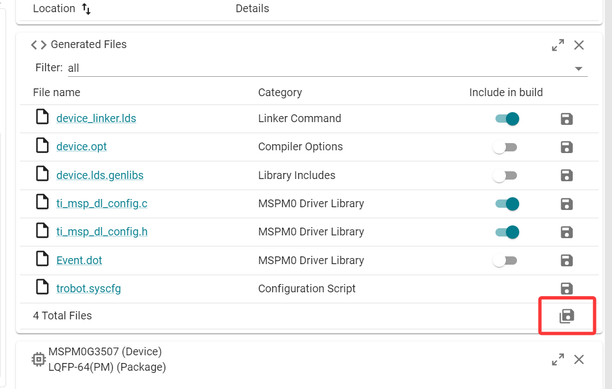

## TRobot (TI MSPM0G3507)

**T**GU **R**obot: The next robot embedded development framework.

> [!NOTE]
> - 由于电赛会有限制 `mspm0` 系列芯片的题，所以搓了一个 trobot 的分支项目 :yum:。
> - 本项目使用 CMake + GCC + OpenOCD 工具链，支持各类烧录器。
> - 该项目基于立创天猛星开发，参考：[【立创·天猛星MSPM0G3507开发板】入门手册](https://wiki.lckfb.com/zh-hans/tmx-mspm0g3507/keil-beginner/)。
> - 若要使用 `mspm0g3519`，需要改一改 `core` 里的 `CMakeLists.txt`。
> - 项目随缘更新，不保证功能完善，Welcome PRs。

### 快速开始

#### 1. 替换你的 OpenOCD

由于目前主线 OpenOCD 还没有支持 MSPM0，所以需要替换为 TI 提供的 OpenOCD 分支。

下载链接：<https://software-dl.ti.com/ccs/esd/vscode/ti-embedded-debug/ti-openocd.html>

使用这个版本替换你原来的 OpenOCD 即可。

若你未曾使用过 OpenOCD，可以直接下载这个版本，主线支持的芯片和烧录器它都支持。

#### 2. 克隆项目

```bash
git clone https://github.com/lym12321/trobot_m0.git --recursive
```

#### 3. 构建项目

该项目提供了完整的 CMake 构建系统，支持使用 VSCode 或 CLion 等你喜欢的 IDE 来构建项目。

结合 OpenOCD，可实现对 MSPM0 系列芯片的烧录和调试。

#### 4. SYSCONFIG

你可以使用 [TI SYSCONFIG](https://www.ti.com.cn/tool/cn/SYSCONFIG) 打开项目下 `core/trobot.syscfg` 文件。

修改配置后需点击保存按钮生成相应文件：



其生成的 `device_linker.lds`、`ti_msp_dl_config.c` 和 `ti_msp_dl_config.h` 文件同样需保存在 `core` 路径下，只有这样才能被 CMake 正确包含。

### 常见问题

#### 为什么 UART 接收回调中调用 `bsp_uart_printf()` 没有输出？

UART 接收回调运行在中断上下文。为避免格式化和阻塞发送长时间占用中断，`bsp_uart_printf()` 与 `bsp_uart_printf_async()` 都会在中断中返回 `false`。请在回调中只记录必要状态，使用 `FromISR` 接口通知任务，再由任务解析和格式化发送。MSPM0G3507 的 UART RX FIFO 只有 4 entries；在 2 Mbaud 连续数据流中，不要复制大块数据或直接回显，否则回调期间可能发生 overrun。只有协议能保证对端已停止发送时，才适合在回调中使用 `bsp_uart_send_async()` 发送准备好的字节。

#### UART 接收数据超过 128 字节会怎样？

当前每个 UART 的 RX 缓冲区为 128 字节。同一次连续接收只保留前 128 字节，超出部分直接忽略，串口空闲后仅回调一次。

#### 为什么克隆后找不到 `components/utils` 或构建失败？

`components/utils` 是 Git 子模块。请使用 `git clone --recursive` 克隆项目；已有仓库可执行 `git submodule update --init --recursive` 补全子模块。

#### 为什么 OpenOCD 找不到 MSPM0 target 或烧录器？

若提示找不到 `target/ti_mspm0.cfg`，通常是使用了不支持 MSPM0 的 OpenOCD，或脚本搜索路径不正确，请确认运行的是 TI 提供的版本。若 target 脚本能够加载，但提示找不到 CMSIS-DAP、ST-Link 或 XDS110，则应检查所选根目录 `*.cfg`、USB 驱动、连接线和烧录器占用情况。

#### 为什么修改 SysConfig 后代码没有变化或无法构建？

`core/trobot.syscfg` 是外设、引脚、时钟、DMA 和中断配置的源文件。修改后必须使用与文件元数据匹配的 SysConfig 和 MSPM0 SDK 重新生成，并将 `ti_msp_dl_config.c`、`ti_msp_dl_config.h` 和 `device_linker.lds` 保存到 `core`。应用代码应使用生成头文件中的宏，不要猜测或手动维护实例名称。

#### LCD 和 W25Q128 同时使用时为什么会出现显示或读写异常？

LCD 和 W25Q128 共享 SPI1。优先使用各自的 BSP 接口，它们会管理总线锁和片选。自定义 LCD 像素流需要在设置地址、开始写入、传输数据和结束写入的完整过程外持有 `bsp_spi_lock(SPI1_INST)`，并避免从 ISR 访问共享 SPI 总线。
